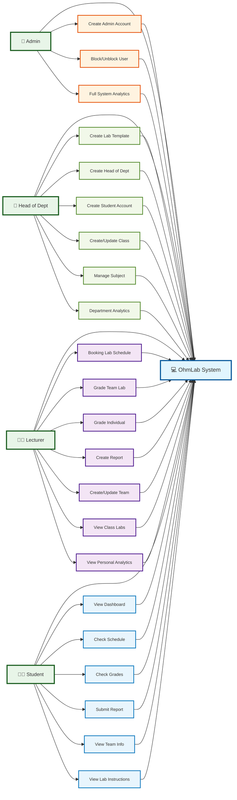

# OhmLab System Flow - Compact Role Version

---

**Cách sử dụng:** Copy code mermaid và paste vào công cụ hỗ trợ mermaid.

**Đặc điểm:**
- Compact layout dễ chụp hình
- Icons trực quan cho từng role
- Font size optimized cho document
- Flow gọn gàng, không rườm rà
- Phân quyền rõ ràng theo codebase thực tế
