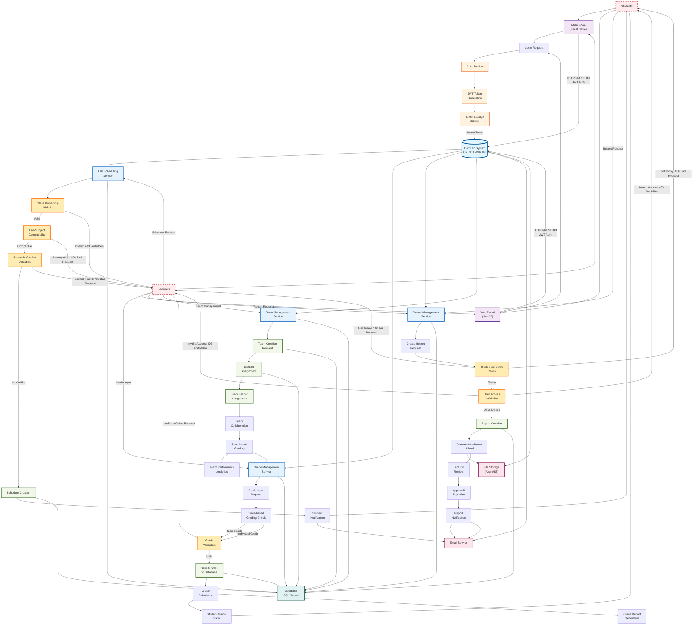

# Complete OhmLab System Flow - Mermaid Code

---

**Cách sử dụng:** Copy toàn bộ code mermaid bên trên và paste vào bất kỳ công cụ nào hỗ trợ mermaid (GitHub, GitLab, Notion, VS Code với extension mermaid, v.v.) để hiển thị sơ đồ flow hoàn chỉnh của hệ thống OhmLab.

**Đặc điểm diagram:**
- Tất cả các luồng đi được tích hợp trong một diagram duy nhất
- Màu sắc phân biệt rõ ràng các loại components
- Luồng success và error được thể hiện riêng biệt
- Các mối quan hệ giữa các modules được hiển thị đầy đủ
