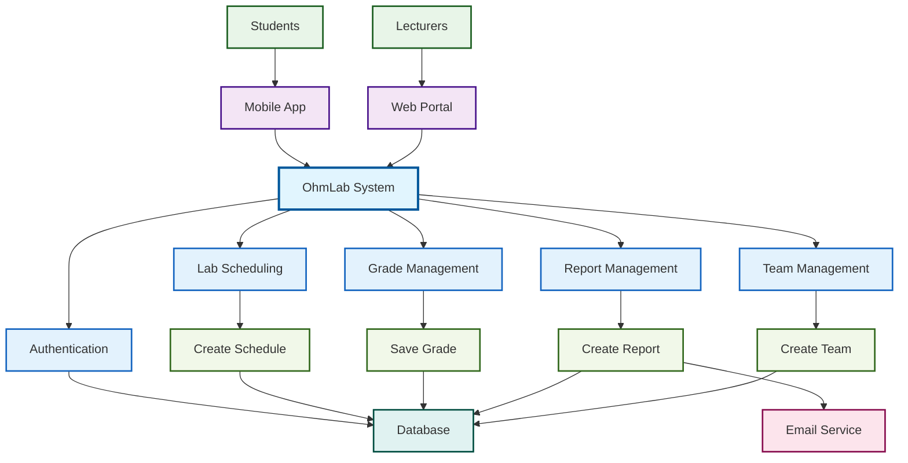

# OhmLab System Flow - Concise Version

---

**Cách sử dụng:** Copy code mermaid và paste vào công cụ hỗ trợ mermaid (GitHub, GitLab, Notion, VS Code với extension mermaid).

**Đặc điểm:**
- Flow gọn gàng, tập trung vào các thành phần chính
- Màu sắc phân biệt rõ ràng
- Dễ theo dõi luồng xử lý
- Bao gồm 4 module chính: Lab Scheduling, Grade Management, Report Management, Team Management
