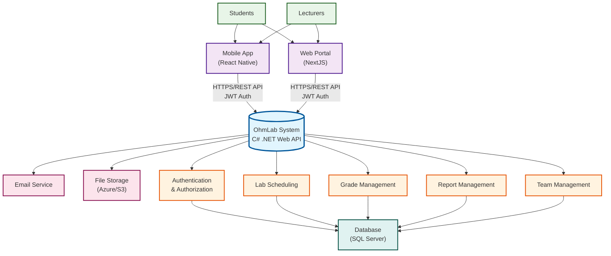
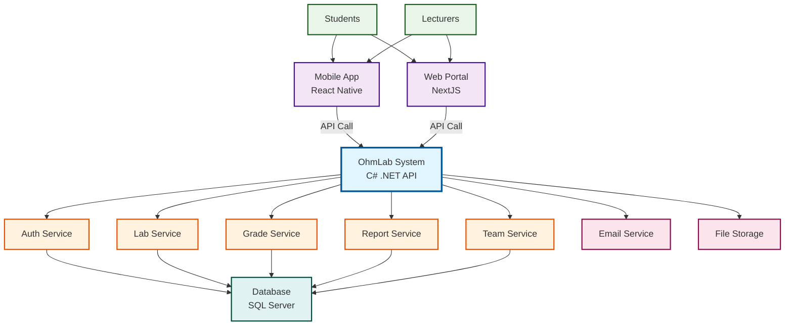

# Mermaid Flow Code - OhmLab System

## 🔄 Main System Flow



## 🔐 Authentication Flow

```mermaid
graph LR
    User["User<br/>(Student/Lecturer)"]
    Login["Login Request"]
    AuthSvc["Auth Service"]
    JWT["JWT Token<br/>Generation"]
    TokenStore["Token Storage<br/>(Client)"]
    ProtectedAPI["Protected API<br/>Endpoint"]
    Validation["Token Validation"]
    Access["Resource Access"]
    
    User --> Login
    Login --> AuthSvc
    AuthSvc -->|"Validate Credentials"| JWT
    JWT --> TokenStore
    TokenStore -->|"Bearer Token"| ProtectedAPI
    ProtectedAPI --> Validation
    Validation -->|"Valid Token"| Access
    Validation -->|"Invalid Token"||"401 Unauthorized"| User
    
    classDef process fill:#e3f2fd,stroke:#1565c0,stroke-width:2px
    classDef data fill:#f1f8e9,stroke:#33691e,stroke-width:2px
    classDef success fill:#e8f5e8,stroke:#1b5e20,stroke-width:2px
    classDef error fill:#ffebee,stroke:#c62828,stroke-width:2px
    
    class AuthSvc,JWT,Validation process
    class TokenStore data
    class Access success
    class User error
```

## 📅 Lab Scheduling Flow

```mermaid
graph TD
    Lecturer["Lecturer"]
    ScheduleRequest["Create Schedule<br/>Request"]
    OwnershipCheck["Class Ownership<br/>Validation"]
    LabCheck["Lab-Subject<br/>Compatibility"]
    ConflictCheck["Schedule Conflict<br/>Detection"]
    ScheduleCreate["Schedule Creation"]
    Notification["Student<br/>Notification"]
    CalendarUpdate["Calendar Update"]
    Success["Schedule Created<br/>Successfully"]
    
    Lecturer --> ScheduleRequest
    ScheduleRequest --> OwnershipCheck
    OwnershipCheck -->|"Valid"| LabCheck
    LabCheck -->|"Compatible"| ConflictCheck
    ConflictCheck -->|"No Conflict"| ScheduleCreate
    ScheduleCreate --> Notification
    Notification --> CalendarUpdate
    CalendarUpdate --> Success
    
    OwnershipCheck -->|"Invalid"||"403 Forbidden"| Lecturer
    LabCheck -->|"Incompatible"||"400 Bad Request"| Lecturer
    ConflictCheck -->|"Conflict Found"||"400 Bad Request"| Lecturer
    
    classDef user fill:#e8f5e8,stroke:#1b5e20,stroke-width:2px
    classDef validation fill:#fff3e0,stroke:#e65100,stroke-width:2px
    classDef process fill:#e3f2fd,stroke:#1565c0,stroke-width:2px
    classDef success fill:#e8f5e8,stroke:#1b5e20,stroke-width:2px
    classDef error fill:#ffebee,stroke:#c62828,stroke-width:2px
    
    class Lecturer user
    class OwnershipCheck,LabCheck,ConflictCheck validation
    class ScheduleCreate,Notification,CalendarUpdate process
    class Success success
    class Lecturer error
```

## 📊 Grade Management Flow

```mermaid
graph LR
    Lecturer["Lecturer"]
    GradeInput["Grade Input<br/>Request"]
    TeamCheck["Team-based<br/>Grading Check"]
    GradeValidation["Grade<br/>Validation"]
    GradeSave["Save to<br/>Database"]
    GradeCalc["Grade<br/>Calculation"]
    StudentView["Student Grade<br/>View"]
    ReportGen["Report<br/>Generation"]
    
    Lecturer --> GradeInput
    GradeInput --> TeamCheck
    TeamCheck -->|"Team Grade"| GradeValidation
    TeamCheck -->|"Individual Grade"| GradeValidation
    GradeValidation -->|"Valid"| GradeSave
    GradeSave --> GradeCalc
    GradeCalc --> StudentView
    GradeCalc --> ReportGen
    
    GradeValidation -->|"Invalid"||"400 Bad Request"| Lecturer
    
    classDef user fill:#e8f5e8,stroke:#1b5e20,stroke-width:2px
    classDef process fill:#e3f2fd,stroke:#1565c0,stroke-width:2px
    classDef data fill:#f1f8e9,stroke:#33691e,stroke-width:2px
    classDef output fill:#f3e5f5,stroke:#4a148c,stroke-width:2px
    classDef error fill:#ffebee,stroke:#c62828,stroke-width:2px
    
    class Lecturer user
    class TeamCheck,GradeValidation,GradeSave,GradeCalc process
    class StudentView data
    class ReportGen output
    class Lecturer error
```

## 📝 Report Creation Flow

```mermaid
graph TD
    User["User<br/>(Student/Lecturer)"]
    ReportRequest["Create Report<br/>Request"]
    DateCheck["Today's Schedule<br/>Check"]
    AccessCheck["User Access<br/>Validation"]
    ReportCreate["Report Creation"]
    ContentUpload["Content/Attachment<br/>Upload"]
    LecturerReview["Lecturer<br/>Review"]
    Approval["Approval/<br/>Rejection"]
    Notification["Notification<br/>System"]
    
    User --> ReportRequest
    ReportRequest --> DateCheck
    DateCheck -->|"Today"| AccessCheck
    AccessCheck -->|"Valid Access"| ReportCreate
    ReportCreate --> ContentUpload
    ContentUpload --> LecturerReview
    LecturerReview --> Approval
    Approval --> Notification
    
    DateCheck -->|"Not Today"||"400 Bad Request"| User
    AccessCheck -->|"Invalid Access"||"403 Forbidden"| User
    
    classDef user fill:#e8f5e8,stroke:#1b5e20,stroke-width:2px
    classDef validation fill:#fff3e0,stroke:#e65100,stroke-width:2px
    classDef process fill:#e3f2fd,stroke:#1565c0,stroke-width:2px
    classDef review fill:#f3e5f5,stroke:#4a148c,stroke-width:2px
    classDef error fill:#ffebee,stroke:#c62828,stroke-width:2px
    
    class User user
    class DateCheck,AccessCheck validation
    class ReportCreate,ContentUpload,Notification process
    class LecturerReview,Approval review
    class User error
```

## 👥 Team Management Flow



```mermaid
graph LR
    Lecturer["Lecturer"]
    TeamCreate["Team Creation<br/>Request"]
    StudentAssign["Student<br/>Assignment"]
    LeaderAssign["Team Leader<br/>Assignment"]
    TeamCollab["Team<br/>Collaboration"]
    TeamGrading["Team-based<br/>Grading"]
    Analytics["Team Performance<br/>Analytics"]
    
    Lecturer --> TeamCreate
    TeamCreate --> StudentAssign
    StudentAssign --> LeaderAssign
    LeaderAssign --> TeamCollab
    TeamCollab --> TeamGrading
    TeamGrading --> Analytics
    
    classDef user fill:#e8f5e8,stroke:#1b5e20,stroke-width:2px
    classDef process fill:#e3f2fd,stroke:#1565c0,stroke-width:2px
    classDef collaboration fill:#f3e5f5,stroke:#4a148c,stroke-width:2px
    classDef analytics fill:#fff3e0,stroke:#e65100,stroke-width:2px
    
    class Lecturer user
    class TeamCreate,StudentAssign,LeaderAssign process
    class TeamCollab collaboration
    class TeamGrading,Analytics analytics
```

## 🎯 Complete Integration Flow



---

**Cách sử dụng:** Copy các code mermaid bên trên và paste vào bất kỳ công cụ nào hỗ trợ mermaid (GitHub, GitLab, Notion, VS Code với extension mermaid, v.v.) để hiển thị sơ đồ flow.
