# OhmLab System Flow - Role-Based Version

```mermaid
graph TD
    %% User Roles
    Admin["Admin"]
    HeadOfDept["Head of Department"]
    Lecturer["Lecturer"] 
    Student["Student"]
    
    %% System
    OhmLab["OhmLab System"]
    
    %% Admin Functions
    CreateAdmin["Create Admin Account"]
    BlockUser["Block/Unblock User"]
    FullAnalytics["Full System Analytics"]
    
    %% Head of Department Functions
    CreateLab["Create Lab Template"]
    CreateHOD["Create Head of Dept"]
    CreateStudent["Create Student Account"]
    ManageClass["Create/Update Class"]
    ManageSubject["Manage Subject"]
    DeptAnalytics["Department Analytics"]
    
    %% Lecturer Functions
    BookingSchedule["Booking Lab Schedule"]
    GradeTeam["Grade Team Lab"]
    GradeMember["Grade Individual"]
    CreateReport["Create Report"]
    ManageTeam["Create/Update Team"]
    ViewClassLabs["View Class Labs"]
    LecturerAnalytics["View Personal Analytics"]
    
    %% Student Functions
    ViewDashboard["View Student Dashboard"]
    CheckSchedule["Check Schedule"]
    CheckGrades["Check Grades"]
    SubmitReport["Submit Report"]
    ViewTeam["View Team Info"]
    LabInstructions["View Lab Instructions"]
    
    %% Main Connections
    Admin --> OhmLab
    HeadOfDept --> OhmLab
    Lecturer --> OhmLab
    Student --> OhmLab
    
    %% Admin Flow
    Admin --> CreateAdmin
    Admin --> BlockUser
    Admin --> FullAnalytics
    
    %% Head of Department Flow
    HeadOfDept --> CreateLab
    HeadOfDept --> CreateHOD
    HeadOfDept --> CreateStudent
    HeadOfDept --> ManageClass
    HeadOfDept --> ManageSubject
    HeadOfDept --> DeptAnalytics
    
    %% Lecturer Flow
    Lecturer --> BookingSchedule
    Lecturer --> GradeTeam
    Lecturer --> GradeMember
    Lecturer --> CreateReport
    Lecturer --> ManageTeam
    Lecturer --> ViewClassLabs
    Lecturer --> LecturerAnalytics
    
    %% Student Flow
    Student --> ViewDashboard
    Student --> CheckSchedule
    Student --> CheckGrades
    Student --> SubmitReport
    Student --> ViewTeam
    Student --> LabInstructions
    
    %% Connections to System
    CreateAdmin --> OhmLab
    BlockUser --> OhmLab
    FullAnalytics --> OhmLab
    CreateLab --> OhmLab
    CreateHOD --> OhmLab
    CreateStudent --> OhmLab
    ManageClass --> OhmLab
    ManageSubject --> OhmLab
    DeptAnalytics --> OhmLab
    BookingSchedule --> OhmLab
    GradeTeam --> OhmLab
    GradeMember --> OhmLab
    CreateReport --> OhmLab
    ManageTeam --> OhmLab
    ViewClassLabs --> OhmLab
    LecturerAnalytics --> OhmLab
    ViewDashboard --> OhmLab
    CheckSchedule --> OhmLab
    CheckGrades --> OhmLab
    SubmitReport --> OhmLab
    ViewTeam --> OhmLab
    LabInstructions --> OhmLab
    
    %% Styling
    classDef roles fill:#e8f5e8,stroke:#1b5e20,stroke-width:3px
    classDef system fill:#e1f5fe,stroke:#01579b,stroke-width:3px
    classDef admin fill:#fff3e0,stroke:#e65100,stroke-width:2px
    classDef headofdept fill:#f1f8e9,stroke:#558b2f,stroke-width:2px
    classDef lecturer fill:#f3e5f5,stroke:#4a148c,stroke-width:2px
    classDef student fill:#e8f5fd,stroke:#0277bd,stroke-width:2px
    
    class Admin,HeadOfDept,Lecturer,Student roles
    class OhmLab system
    class CreateAdmin,BlockUser,FullAnalytics admin
    class CreateLab,CreateHOD,CreateStudent,ManageClass,ManageSubject,DeptAnalytics headofdept
    class BookingSchedule,GradeTeam,GradeMember,CreateReport,ManageTeam,ViewClassLabs,LecturerAnalytics lecturer
    class ViewDashboard,CheckSchedule,CheckGrades,SubmitReport,ViewTeam,LabInstructions student
```

---

**Cách sử dụng:** Copy code mermaid và paste vào công cụ hỗ trợ mermaid (GitHub, GitLab, Notion, VS Code với extension mermaid).

**Đặc điểm:**
- Phân rõ quyền hạn từng role dựa trên codebase thực tế
- Admin: Create Admin Account, Block/Unblock User, Full System Analytics
- Head of Department: Create Lab Template, Create Head of Dept, Create Student Account, Create/Update Class, Manage Subject, Department Analytics
- Lecturer: Booking Lab Schedule, Grade Team Lab, Grade Individual, Create Report, Create/Update Team, View Class Labs, View Personal Analytics
- Student: View Student Dashboard, Check Schedule, Check Grades, Submit Report, View Team Info, View Lab Instructions
- Màu sắc phân biệt từng nhóm chức năng
- Flow đơn giản, dễ hiểu
