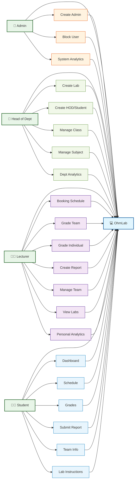

# OhmLab System Flow - Ultra Compact

```mermaid
graph LR
    A[🔧 Admin] --> O[💻 OhmLab]
    H[👔 Head of Dept] --> O
    L[👨‍🏫 Lecturer] --> O
    S[👨‍🎓 Student] --> O
    
    A --> A1[Create Admin] --> O
    A --> A2[Block User] --> O
    A --> A3[System Analytics] --> O
    
    H --> H1[Create Lab] --> O
    H --> H2[Create HOD/Student] --> O
    H --> H3[Manage Class] --> O
    H --> H4[Manage Subject] --> O
    H --> H5[Dept Analytics] --> O
    
    L --> L1[Booking Schedule] --> O
    L --> L2[Grade Team] --> O
    L --> L3[Grade Individual] --> O
    L --> L4[Create Report] --> O
    L --> L5[Manage Team] --> O
    L --> L6[View Labs] --> O
    L --> L7[Personal Analytics] --> O
    
    S --> S1[Dashboard] --> O
    S --> S2[Schedule] --> O
    S --> S3[Grades] --> O
    S --> S4[Submit Report] --> O
    S --> S5[Team Info] --> O
    S --> S6[Lab Instructions] --> O
    
    classDef role fill:#e8f5e8,stroke:#1b5e20,stroke-width:2px
    classDef sys fill:#e1f5fe,stroke:#01579b,stroke-width:2px
    classDef admin fill:#fff3e0,stroke:#e65100,stroke-width:1px
    classDef hod fill:#f1f8e9,stroke:#558b2f,stroke-width:1px
    classDef lec fill:#f3e5f5,stroke:#4a148c,stroke-width:1px
    classDef stu fill:#e8f5fd,stroke:#0277bd,stroke-width:1px
    
    class A,H,L,S role
    class O sys
    class A1,A2,A3 admin
    class H1,H2,H3,H4,H5 hod
    class L1,L2,L3,L4,L5,L6,L7 lec
    class S1,S2,S3,S4,S5,S6 stu
```

---

**Copy mermaid code để sử dụng**
